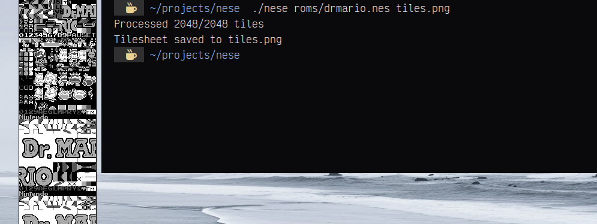

<div align="center">

## ｎｅｓｅ
**[ a NES CHR ROM tile extractor ]**

[](http://unlicense.org/)
[](https://en.wikipedia.org/wiki/C_(programming_language))
</div>

## ✧ why
a quick and easy thing i needed for getting stuff out of my legally owned nes roms

## ✧ preview
<p align="center">
    
</p>

## ✧ features
- 🎮 extracts CHR ROM data from NES files
- 🖼️ exports to individual PNG tiles or complete tilesheets
- 🎨 customizable palette support
- 📏 adjustable tile dimensions
- 📄 generates JSON/XML metadata
- ⚡ fast and efficient processing
- 🔧 minimal dependencies

## ✧ installation
```bash
git clone https://github.com/getjared/nese.git
cd nese
make
sudo make install
```

## ✧ dependencies
- 📝 c compiler (gcc or clang)
- 🔧 make
- 📚 stb_image_write.h (included)

## ✧ usage
### basic usage
```bash
nese <input_rom> <output_path> [options]
```

### options
| option | description |
|--------|-------------|
| `-d, --dir` | export tiles to individual files |
| `-p <file>` | specify custom palette file |
| `-w <width>` | set tile width (default: 8) |
| `-h <height>` | set tile height (default: 8) |
| `-m <path>` | generate metadata file |
| `-f <format>` | metadata format (json/xml) |

### examples
export as tilesheet:
```bash
nese game.nes tiles.png
```

export individual tiles:
```bash
nese game.nes tiles/ -d
```

custom palette with metadata:
```bash
nese game.nes tiles.png -p palette.txt -m metadata.json
```

## ✧ configuration
### palette format
create a text file with 4 RGB color values (0-255):
```
0 0 0         # Color 0: Black
85 85 85      # Color 1: Dark Gray
170 170 170   # Color 2: Light Gray
255 255 255   # Color 3: White

```

### metadata output
JSON format:
```json
{
    "tile_width": 8,
    "tile_height": 8,
    "tiles_per_row": 16,
    "total_tiles": 256,
    "tiles": [
        {
            "index": 1,
            "filename": "tile_0001.png",
            "position": { "x": 0, "y": 0 }
        }
    ]
}
```

## ✧ inspiration
crafted with inspiration from:
- nes development tools
- tile extraction utilities
- image processing libraries

<div align="center">

```ascii
╭─────────────────────────╮
│  made with ♥ by jared   │
╰─────────────────────────╯
```
</div>
